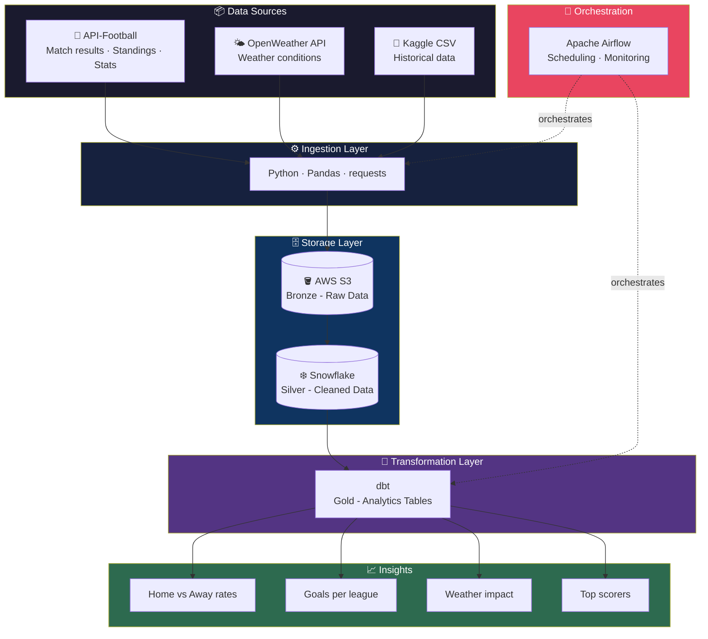
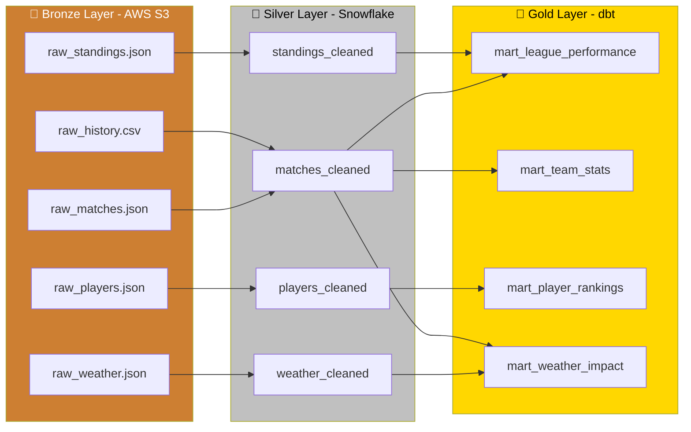
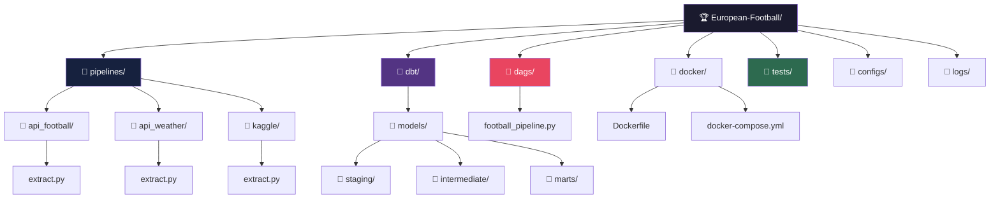
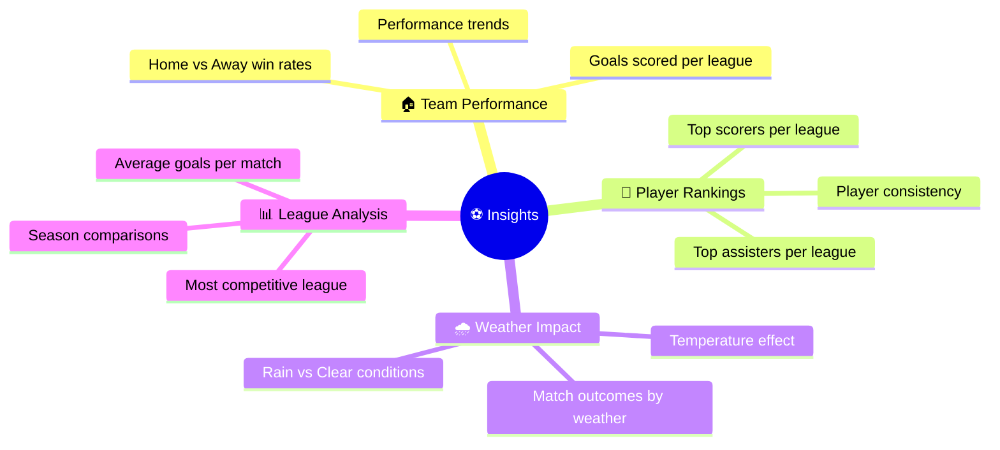

# 🏆 European Football Analytics Platform 

> **🚧 UNDER ACTIVE DEVELOPMENT ON BRANCH `develop` 🚧** 

An end-to-end data engineering pipeline that collects, transforms, and analyzes
football data from the 5 major European leagues using a modern data stack.


---

## 📋 Description

This project builds a production-grade data pipeline covering the 5 major
European football leagues:

- 🏴󠁧󠁢󠁥󠁮󠁧󠁿 **Premier League** (England)
- 🇪🇸 **La Liga** (Spain)
- 🇮🇹 **Serie A** (Italy)
- 🇩🇪 **Bundesliga** (Germany)
- 🇫🇷 **Ligue 1** (France)

---

## 🏗️ Global Architecture



---

## 🥉🥈🥇 Medallion Architecture



---

## 🔄 Pipeline Flow


---

## 📁 Project Structure



---

## 🛠️ Tech Stack

| Tool | Version | Purpose |
|------|---------|---------|
|  | 3.8+ | Data ingestion & transformation |
|  | 2.0+ | Pipeline orchestration |
|  | - | Raw data storage (Bronze) |
|  | - | Data Warehouse (Silver) |
|  | 1.0+ | Data transformation (Gold) |
|  | - | Containerization |
|  | - | Unit testing |

---

## 📊 Data Sources

| Source | Type | Data |
|--------|------|------|
| [API-Football](https://api-football.com) | REST API | Match results, standings, player stats |
| [OpenWeather](https://openweathermap.org) | REST API | Weather conditions at match locations |
| [Kaggle](https://kaggle.com) | CSV | Historical football data |

---

## 📈 Analytics Insights



---

## 🚀 Getting Started

### Prerequisites

- Python 3.8+
- Docker Desktop
- AWS Account (Free Tier)
- Snowflake Account

### Installation

```bash
# Clone the repository
git clone https://github.com/ton-username/European-Football.git
cd European-Football

# Install dependencies
pip install -r requirements.txt

# Configure environment variables
cp .env.example .env
# Edit .env with your API keys and credentials

# Start with Docker
docker-compose up -d
```

---

## 👤 Author

**NJINE TIENCHEU Elie**
Software & Data Engineer

[](https://github.com/Elie-dev25)
[](https://www.linkedin.com/in/elie-njine-736b04274)
[](https://elie-njine.online)
[](mailto:contact@elie-njine.online)

---

*🚧 Project currently in progress — Star ⭐ this repo to follow the progress!*
