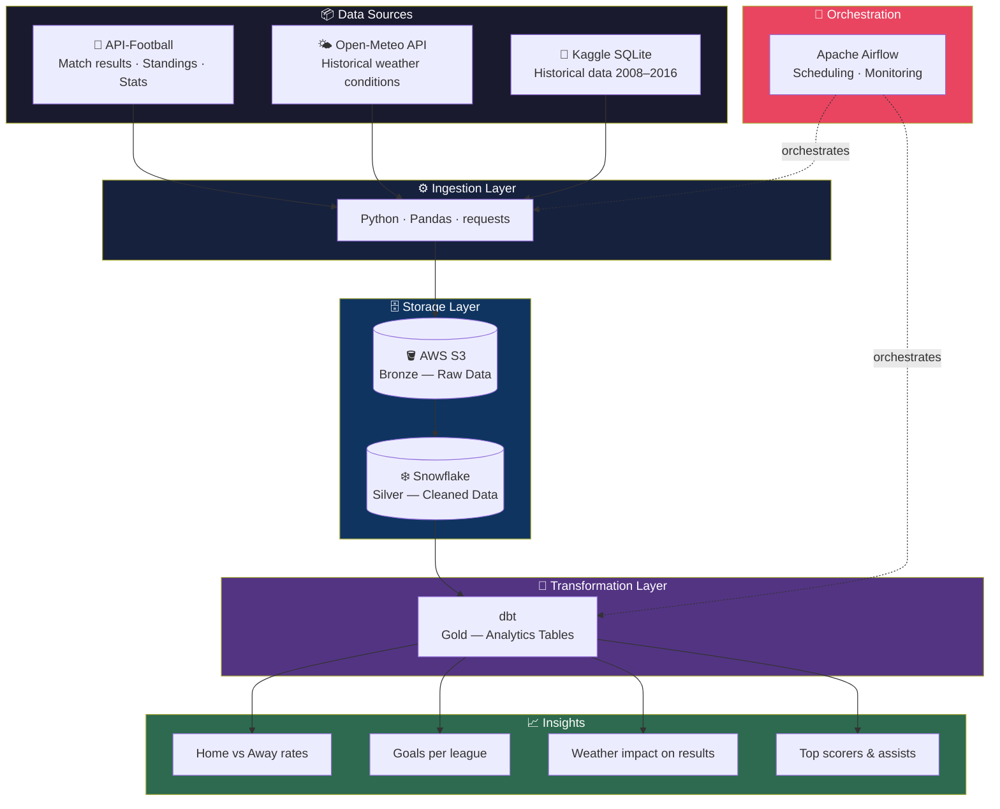
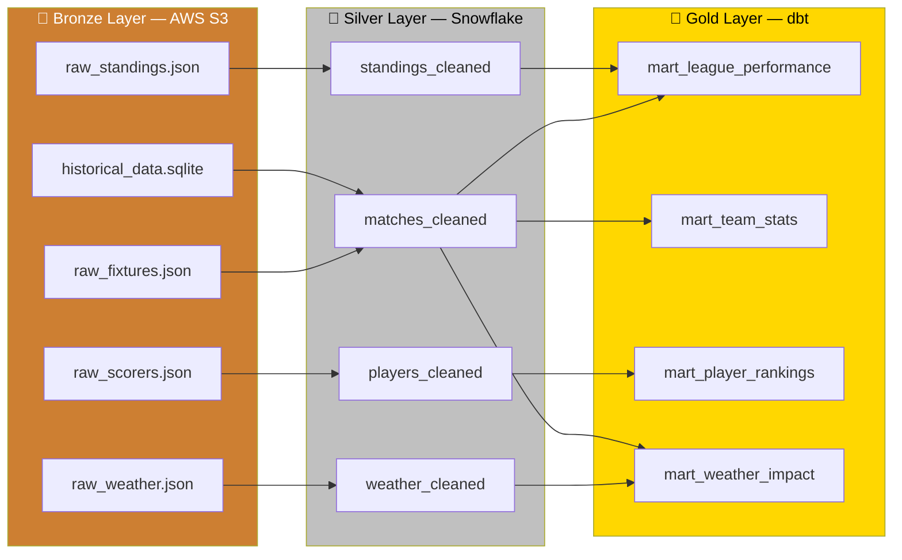
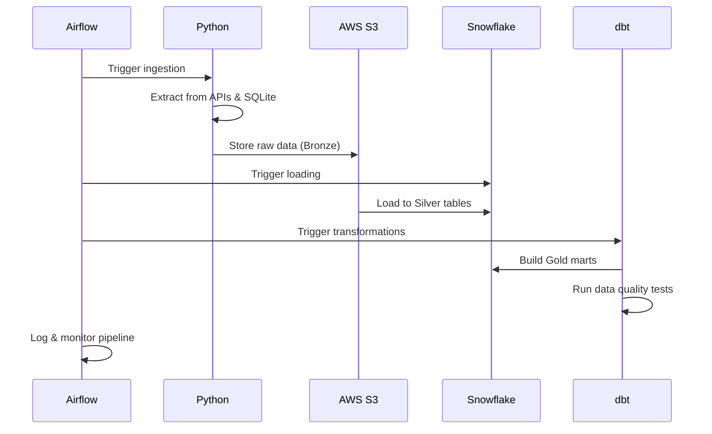
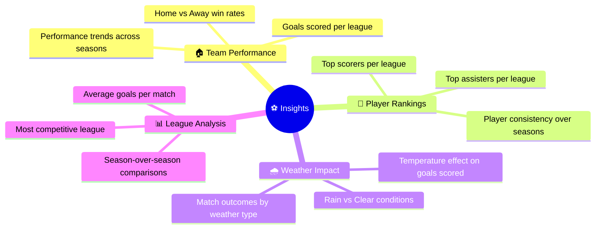

# 🏆 European Football Analytics Platform

An end-to-end data engineering pipeline — currently under active development — that will collect,
transform, and analyze football statistics from the 5 major European leagues using a modern,
production-grade data stack.


> 🚧 **This project is actively being built.** Every phase is documented as it is completed.
> The architecture and decisions below reflect the full target state — not the current state.
> See [Current Status](#-current-status) for exactly where things stand today.

---

## 📋 Description

This project builds a **production-grade data pipeline** covering the 5 major European football leagues:

- 🏴󠁧󠁢󠁥󠁮󠁧󠁿 **Premier League** (England)
- 🇪🇸 **La Liga** (Spain)
- 🇮🇹 **Serie A** (Italy)
- 🇩🇪 **Bundesliga** (Germany)
- 🇫🇷 **Ligue 1** (France)

**Why this project?**
- **Multi-source ingestion** — demonstrates the ability to handle real-world data complexity
- **Modern stack** — tools used in production at data-driven companies in 2025-2026
- **Concrete domain** — football is universally understood, making it easy for any recruiter to evaluate the analytical output

---

## 🚧 Current Status

> Last updated: June 2026

| Phase | Description | Status |
|-------|-------------|--------|
| **Phase 1** | Ingestion — API-Football | ✅ Done |
| **Phase 1** | Ingestion — Open-Meteo (weather) | 🔄 In progress |
| **Phase 1** | Ingestion — Kaggle SQLite (historical) | ⬜ Not started |
| **Phase 2** | AWS S3 — Bronze layer upload | ⬜ Not started |
| **Phase 3** | Snowflake — Silver layer | ⬜ Not started |
| **Phase 4** | dbt — Gold layer transformations | ⬜ Not started |
| **Phase 5** | Apache Airflow — Orchestration | ⬜ Not started |
| **Phase 6** | Docker — Containerization | ⬜ Not started |
| **Phase 7** | Tests (pytest) + Final documentation | ⬜ Not started |

**What works today:**
- Full extraction pipeline for API-Football: standings, fixtures, top scorers, top assists
- Covers all 5 leagues for season 2022 (extensible to 2023–2024 with one config change)
- Automatic retry on rate-limit errors (429), structured logging compatible with Airflow
- Raw data saved locally as JSON files under `data/raw/api_football/`

**What does not work yet:**
- Weather ingestion (in progress)
- No S3 upload yet — data stays local
- No Snowflake, dbt, Airflow, or Docker setup yet
- `docker-compose up` in the Getting Started section will not work until Phase 6

---

## 🗄️ Data Sources

| Source | Type | Data | Period | Why |
|--------|------|------|--------|-----|
| [API-Football](https://api-football.com) | REST API | Standings, fixtures, top scorers, top assists | 2022–2024 | Structured, recent football data |
| [Open-Meteo](https://open-meteo.com) | REST API | Weather at stadium cities at match time | 2022–2024 | Free, open-source, historical data back to 1940 — no API key required |
| [Kaggle Soccer DB](https://www.kaggle.com) | SQLite file | Historical match and player data | 2008–2016 | Fills the historical gap not covered by the API-Football free tier |
| [OpenStreetMap Nominatim](https://nominatim.openstreetmap.org) | REST API | GPS coordinates of stadiums | One-shot | Free geocoding API used to generate `dbt/seeds/stadiums.csv` — no API key required |

**Why 4 separate sources?**
In real data engineering environments, data never comes from a single place. Managing multiple heterogeneous sources — APIs, files, databases — is a core skill this project intentionally demonstrates.

**Note on weather source:** OpenWeather was initially planned but its free tier does not include historical data access. Open-Meteo was selected as a replacement — it provides free historical weather data globally since 1940, is fully open-source, and requires no API key for non-commercial use.

---

## 🏗️ Target Architecture



---

## 🥉🥈🥇 Medallion Architecture



**Why Medallion?**
- **Bronze** — raw data preserved as-is, always recoverable
- **Silver** — cleaned and structured, ready for analysis
- **Gold** — analytics-ready tables, directly usable for insights and dashboards
- Industry standard: separates concerns, allows reprocessing at any stage without rebuilding everything

---

## 🔄 Target Pipeline Flow



---

## 📁 Project Structure

```
European-Football/
│
├── pipelines/
│   ├── api_football/
│   │   └── extract.py          ✅ Done — standings, fixtures, scorers, assists
│   ├── api_weather/
│   │   └── extract.py          🔄 In progress — Open-Meteo historical weather
│   └── kaggle/
│       └── extract.py          ⬜ Not started — SQLite extraction
│
├── scripts/
│   └── generate_stadiums_seed.py  ✅ Done — geocodes stadiums via Nominatim → stadiums.csv
│
├── dags/
│   └── football_pipeline.py    ⬜ Not started — Airflow DAG
│
├── dbt/
│   ├── seeds/
│   │   └── stadiums.csv        ✅ Done — 99 stadiums with GPS coordinates (dbt seed, Phase 4)
│   └── models/
│       ├── staging/            ⬜ Not started
│       ├── intermediate/       ⬜ Not started
│       └── marts/              ⬜ Not started
│
├── docker/
│   ├── Dockerfile              ⬜ Not started
│   └── docker-compose.yml      ⬜ Not started
│
├── tests/
│   └── ...                     ⬜ Not started — pytest with mocks
│
├── configs/
├── data/
│   └── raw/
│       └── api_football/       ✅ Local JSON files (pre-S3 upload)
│
├── requirements.txt
├── .env
└── README.md
```

---

## 🛠️ Tech Stack

| Tool | Purpose | Status |
|------|---------|--------|
| **Python 3.8+** | Data ingestion & transformation | ✅ In use |
| **requests** | HTTP calls to REST APIs | ✅ In use |
| **Pandas** | Data manipulation | ✅ In use |
| **AWS S3** | Raw data storage — Bronze layer | ⬜ Phase 2 |
| **Snowflake** | Data Warehouse — Silver layer | ⬜ Phase 3 |
| **dbt** | Data transformations — Gold layer | ⬜ Phase 4 |
| **Apache Airflow** | Pipeline orchestration & scheduling | ⬜ Phase 5 |
| **Docker** | Containerization & reproducibility | ⬜ Phase 6 |
| **pytest** | Unit testing with mocks | ⬜ Phase 7 |

---

## 📐 Key Architecture Decisions

| Decision | Rationale |
|----------|-----------|
| `SEASONS = [2022]` in Phase 1 | Validate the architecture on one season first; extend to `[2022, 2023, 2024]` after — the code already supports it with a single config change |
| One function per API endpoint | Single Responsibility Principle — each function is independently readable and testable |
| Generic `_call_api()` internal function | DRY principle — all HTTP logic (retry, timeout, error handling) centralized in one place |
| Local JSON save before S3 upload | Never lose already-fetched data if a later step fails — save immediately after each extraction |
| `logging` instead of `print()` | Airflow captures Python `logging` natively — using `print()` would make logs invisible once orchestrated |
| Docker in Phase 6, not Phase 1 | Validate the code locally first, containerize once it works — avoids debugging two layers at once |
| Open-Meteo instead of OpenWeather | OpenWeather free tier has no historical data access. Open-Meteo provides free historical weather since 1940, open-source, no API key required |
| Stadium coordinates as a dbt seed | GPS coordinates are reference data, not operational data — they belong in `dbt/seeds/stadiums.csv`, versioned in Git and loaded into Snowflake via `dbt seed`. Generated once via `scripts/generate_stadiums_seed.py` using Nominatim, updated only when new teams appear |

---

## 📊 Planned Analytics Insights



---

## 🚀 Getting Started

> ⚠️ **The project is in Phase 1.** Only local ingestion is functional at this stage.
> Docker, Airflow, and Snowflake setup are planned for later phases.

### Prerequisites

- Python 3.8+
- API-Football account (free tier — 100 requests/day)
- AWS account (for Phase 2)
- Snowflake account (for Phase 3)

### Installation

```bash
# Clone the repository
git clone https://github.com/Elie-dev25/European-Football.git
cd European-Football

# Install dependencies
pip install -r requirements.txt

# Configure environment variables
cp .env.example .env
# Edit .env with your API keys and credentials
```

### Run the ingestion (Phase 1 — current)

```bash
# Extract data from API-Football for season 2022
python pipelines/api_football/extract.py
```

Raw data will be saved to `data/raw/api_football/` as JSON files.

```bash
# Generate the stadiums reference seed (one-shot, run once per new season)
# Reads fixtures JSON → geocodes stadiums via Nominatim → saves dbt/seeds/stadiums.csv
python scripts/generate_stadiums_seed.py
```

---

## 👤 Author

**NJINE TIENCHEU Elie**
Software & Data Engineer

[](https://github.com/Elie-dev25)
[](https://www.linkedin.com/in/elie-njine-736b04274)
[](https://elie-njine.online)
[](mailto:contact@elie-njine.online)

---

*🚧 Project actively in progress — Star ⭐ this repo to follow the build!*