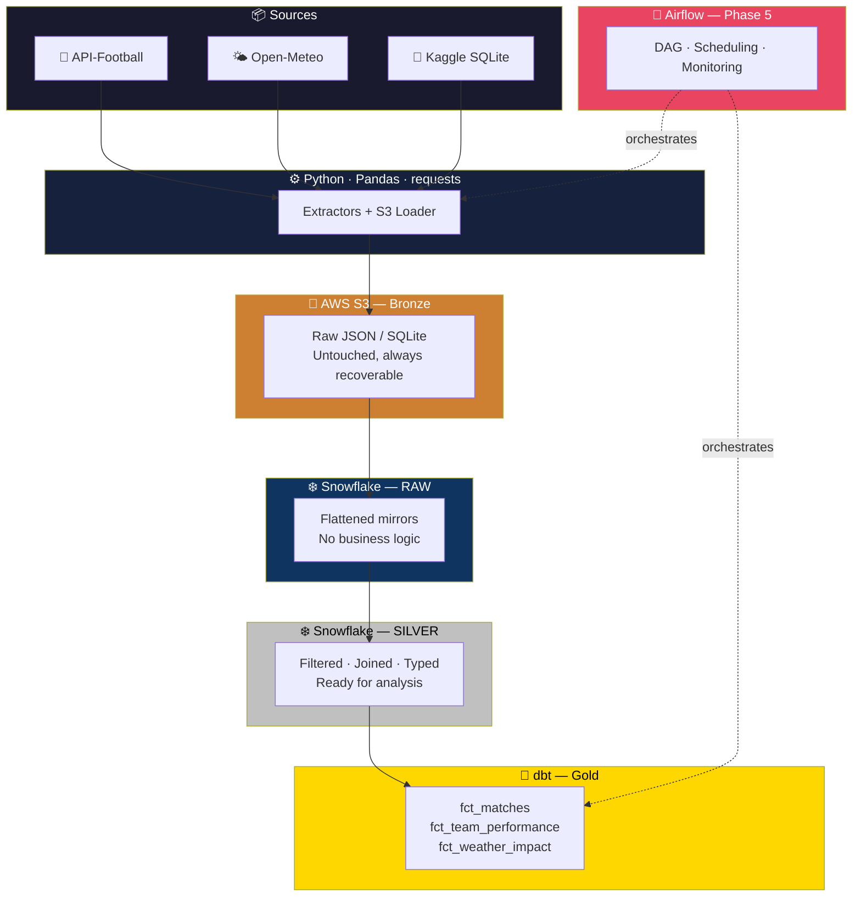
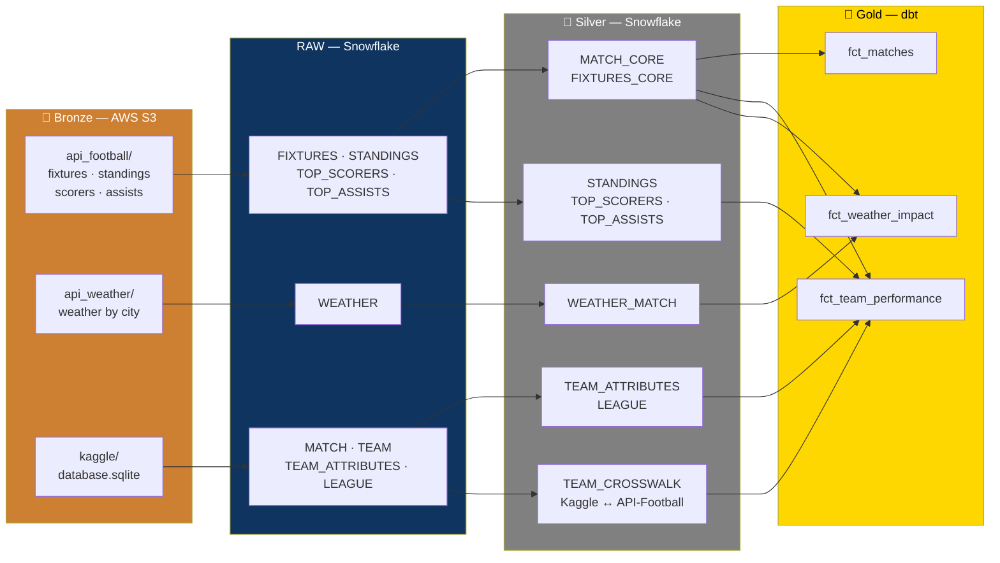
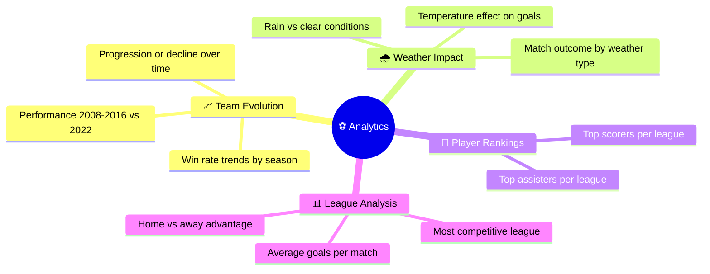

# 🏆 European Football Analytics Platform

An end-to-end data engineering pipeline — currently under active development — that collects,
transforms, and analyzes football statistics from the 5 major European leagues using a modern,
production-grade data stack.


> 🚧 **This project is actively being built.** Every phase is documented as it is completed.
> The architecture and decisions below reflect the full target state — not the current state.
> See [Current Status](#-current-status) for exactly where things stand today.

---

## 📋 Description

This project builds a **production-grade data pipeline** covering the 5 major European football leagues:

- 🏴󠁧󠁢󠁥󠁮󠁧󠁿 **Premier League** (England)
- 🇪🇸 **La Liga** (Spain)
- 🇮🇹 **Serie A** (Italy)
- 🇩🇪 **Bundesliga** (Germany)
- 🇫🇷 **Ligue 1** (France)

**Central analytical question:** Is a team today better or worse than it was 5–10 years ago?
The pipeline compares team performance across two non-overlapping periods — Kaggle historical data
(2008–2016) and API-Football recent data (2022–2024) — and studies whether weather conditions
influence match results.

**Why this project?**
- **Multi-source ingestion** — demonstrates the ability to handle real-world data complexity across REST APIs, SQLite databases, and cloud storage
- **Modern stack** — tools used in production at data-driven companies in 2025–2026
- **Concrete domain** — football is universally understood, making it easy for any recruiter to evaluate the analytical output

---

## 🚧 Current Status

> Last updated: July 2026

| Phase | Description | Status |
|-------|-------------|--------|
| **Phase 1** | Ingestion — API-Football (fixtures, standings, top scorers, top assists) | ✅ Done |
| **Phase 1** | Ingestion — Open-Meteo (weather at stadium cities) | ✅ Done |
| **Phase 1** | Ingestion — Kaggle SQLite (historical matches, teams, attributes) | ✅ Done |
| **Phase 2** | AWS S3 — Bronze layer upload (idempotent, with retry logic) | ✅ Done |
| **Phase 3** | Snowflake — RAW layer (9 tables, 177 tests) | ✅ Done |
| **Phase 3** | Snowflake — Silver layer (9 tables, all quality checks passing) | ✅ Done |
| **Phase 4** | dbt — Gold layer transformations | ⬜ Next |
| **Phase 5** | Apache Airflow — Orchestration | ⬜ Not started |
| **Phase 6** | Docker — Containerization | ⬜ Not started |

**What works today:**
- Full extraction pipeline for all 4 sources across 196 tests
- Bronze layer fully uploaded to S3 (`european-football` bucket, `us-east-1`), idempotent via `head_object`
- All 9 RAW tables loaded into Snowflake (`FOOTBALL_DB.RAW`) via a generic config-driven loader: S3 (nested JSON) → flatten → STAGING → MERGE INTO RAW (upsert by business key)
- Full Silver layer built (`FOOTBALL_DB.SILVER`) — 9 tables, all with DDL + transformer + unit test + quality check:

| Table | Source | Grain | Rows |
|-------|--------|-------|------|
| `TEAM_CROSSWALK` | Kaggle + API-Football | team | 99 |
| `WEATHER_MATCH` | Open-Meteo | match | 1 829 |
| `MATCH_CORE` | Kaggle | match | 14 585 |
| `FIXTURES_CORE` | API-Football | match (FT only) | — |
| `LEAGUE` | Kaggle | league | 5 |
| `TEAM_ATTRIBUTES` | Kaggle | team × date | 1 457 |
| `STANDINGS` | API-Football | team × league × season | 98 |
| `TOP_SCORERS` | API-Football | player × team × league × season | 80 |
| `TOP_ASSISTS` | API-Football | player × team × league × season | 80 |

**What does not work yet:**
- No Gold layer yet — Silver is clean and structured, ready for dbt
- No Airflow DAG, no Docker setup
- `docker-compose up` will not work until Phase 6

---

## 🗄️ Data Sources

| Source | Type | Data | Period |
|--------|------|------|--------|
| [API-Football](https://api-football.com) | REST API | Standings, fixtures, top scorers, top assists | 2022 |
| [Open-Meteo](https://open-meteo.com) | REST API | Historical weather at stadium cities at match time | 2022 |
| [Kaggle Soccer DB](https://www.kaggle.com) | SQLite | Historical matches, teams, tactical attributes | 2008–2016 |
| [OpenStreetMap Nominatim](https://nominatim.openstreetmap.org) | REST API | GPS coordinates of stadiums | One-shot |

> **Note on periods:** The two main periods (Kaggle 2008–2016 and API-Football 2022) do not overlap.
> No match-level join is possible between them — all longitudinal comparisons are done at team grain
> via `SILVER.TEAM_CROSSWALK`.

> **Note on weather:** OpenWeather was initially planned but its free tier does not include historical
> data. Open-Meteo was selected as a replacement — free, open-source, no API key required.

---

## 🏗️ Target Architecture


```mermaid
flowchart TD
    subgraph Sources["📦 Sources"]
        A[🔌 API-Football]
        B[🌤️ Open-Meteo]
        C[📂 Kaggle SQLite]
    end

    subgraph Ingestion["⚙️ Python · Pandas · requests"]
        D[Extractors + S3 Loader]
    end

    subgraph Bronze["🥉 AWS S3 — Bronze"]
        E[Raw JSON / SQLite\nUntouched, always recoverable]
    end

    subgraph Raw["❄️ Snowflake — RAW"]
        F[Flattened mirrors\nNo business logic]
    end

    subgraph Silver["❄️ Snowflake — SILVER"]
        G[Filtered · Joined · Typed\nReady for analysis]
    end

    subgraph Gold["🥇 dbt — Gold"]
        H[fct_matches\nfct_team_performance\nfct_weather_impact]
    end

    subgraph Orchestration["🎯 Airflow — Phase 5"]
        I[DAG · Scheduling · Monitoring]
    end

    A --> D
    B --> D
    C --> D
    D --> E
    E --> F
    F --> G
    G --> H
    I -.->|orchestrates| D
    I -.->|orchestrates| H

    style Sources fill:#1a1a2e,color:#fff
    style Ingestion fill:#16213e,color:#fff
    style Bronze fill:#cd7f32,color:#fff
    style Raw fill:#0f3460,color:#fff
    style Silver fill:#c0c0c0,color:#000
    style Gold fill:#ffd700,color:#000
    style Orchestration fill:#e94560,color:#fff
```

---

## 🥉🥈🥇 Medallion Architecture


```mermaid
flowchart LR
    subgraph Bronze["🥉 Bronze — AWS S3"]
        B1[api_football/\nfixtures · standings\nscorers · assists]
        B2[api_weather/\nweather by city]
        B3[kaggle/\ndatabase.sqlite]
    end

    subgraph Raw["RAW — Snowflake"]
        R1[FIXTURES · STANDINGS\nTOP_SCORERS · TOP_ASSISTS]
        R2[WEATHER]
        R3[MATCH · TEAM\nTEAM_ATTRIBUTES · LEAGUE]
    end

    subgraph Silver["🥈 Silver — Snowflake"]
        S1[MATCH_CORE\nFIXTURES_CORE]
        S2[WEATHER_MATCH]
        S3[STANDINGS\nTOP_SCORERS · TOP_ASSISTS]
        S4[TEAM_ATTRIBUTES\nLEAGUE]
        S5[TEAM_CROSSWALK\nKaggle ↔ API-Football]
    end

    subgraph Gold["🥇 Gold — dbt"]
        G1[fct_matches]
        G2[fct_team_performance]
        G3[fct_weather_impact]
    end

    B1 --> R1
    B2 --> R2
    B3 --> R3

    R1 --> S1
    R1 --> S3
    R2 --> S2
    R3 --> S4
    R3 --> S5

    S1 --> G1
    S1 --> G2
    S3 --> G2
    S4 --> G2
    S5 --> G2
    S2 --> G3
    S1 --> G3

    style Bronze fill:#cd7f32,color:#fff
    style Raw fill:#0f3460,color:#fff
    style Silver fill:#808080,color:#fff
    style Gold fill:#ffd700,color:#000
```

---

## 📁 Project Structure
```
pipelines/
├── utils.py                          # Snowflake connection + shared config
├── quality.py                        # Generic quality checks (nulls, duplicates, drift)
├── extractors/
│   ├── api_football/extract.py       # API-Football extractor
│   ├── api_weather/extract.py        # Open-Meteo extractor
│   └── kaggle/extract.py             # Kaggle SQLite extractor
├── loaders/
│   ├── s3_loader.py                  # Bronze → S3 (idempotent)
│   ├── snowflake_loader.py           # S3 → STAGING → MERGE → RAW (9 tables)
│   └── snowflake_flatteners.py       # JSON → flat DataFrames
└── transformers/
    ├── team_crosswalk.py             # Kaggle ↔ API-Football identity crosswalk
    ├── silver_weather.py             # SILVER.WEATHER_MATCH
    ├── silver_match_core.py          # SILVER.MATCH_CORE
    ├── silver_fixtures_core.py       # SILVER.FIXTURES_CORE
    ├── silver_league.py              # SILVER.LEAGUE
    ├── silver_team_attributes.py     # SILVER.TEAM_ATTRIBUTES
    ├── silver_standings.py           # SILVER.STANDINGS
    ├── silver_top_scorers.py         # SILVER.TOP_SCORERS
    └── silver_top_assists.py         # SILVER.TOP_ASSISTS

scripts/
├── generate_stadiums_seed.py         # Nominatim → dbt/seeds/stadiums.csv (one-shot)
├── get_orphans_teams.py              # Investigation: orphan team IDs in MATCH_CORE
├── check_match_core_quality.py       # Quality check — MATCH_CORE
├── check_fixtures_core_quality.py    # Quality check — FIXTURES_CORE
├── check_league_quality.py           # Quality check — LEAGUE
├── check_team_attributes_quality.py  # Quality check — TEAM_ATTRIBUTES
├── check_standings_quality.py        # Quality check — STANDINGS
├── check_top_scorers_quality.py      # Quality check — TOP_SCORERS
└── check_top_assists_quality.py      # Quality check — TOP_ASSISTS

snowflake/
├── 00_setup_database.sql             # Database + schema creation
├── raw/                              # 9 RAW table DDLs
├── staging/                          # 9 STAGING table DDLs
└── silver/                           # 9 SILVER table DDLs

dbt/
└── seeds/
    ├── leagues.csv                   # 5 leagues reference data
    └── stadiums.csv                  # 99 stadiums with GPS coordinates

dags/
└── football_pipeline.py              # Airflow DAG (Phase 5)

docker/                               # Phase 6

tests/
├── extractors/                       # API-Football, Open-Meteo, Kaggle
├── loaders/                          # S3 loader, Snowflake flatteners
└── transformers/                     # All 9 Silver transformers
                                      # 196 tests total, all passing

TECH_DEBT.md                          # Tracked technical debt
configs/settings.py
requirements.txt
.env
```

---

## 🛠️ Tech Stack

| Tool | Purpose | Status |
|------|---------|--------|
| **Python 3.12.10** | Extraction, transformation, quality checks | ✅ In use |
| **Pandas** | Data manipulation and flattening | ✅ In use |
| **AWS S3** | Raw data storage — Bronze layer | ✅ Done |
| **Snowflake** | Data warehouse — RAW + Silver layers | ✅ Done |
| **pytest** | 196 unit tests across extractors, loaders, transformers | ✅ In use |
| **dbt** | Gold layer transformations and marts | ⬜ Phase 4 |
| **Apache Airflow** | Pipeline orchestration and scheduling | ⬜ Phase 5 |
| **Docker** | Containerization and reproducibility | ⬜ Phase 6 |

---

## 📐 Key Architecture Decisions

| Decision | Rationale |
|----------|-----------|
| Medallion architecture (Bronze → RAW → Silver → Gold) | Clear separation of concerns — raw data always recoverable, business logic isolated per layer |
| No business logic before Silver | Bronze and RAW are faithful mirrors — no filtering, no joins, no aggregation until Silver |
| dbt reserved for Gold only | Silver transformations stay in Python/SQL — dbt handles only analytics-oriented aggregations in Gold |
| Dynamic filters in Silver (subquery vs hardcoded IDs) | Documents the rule rather than its result — stays correct if source data evolves |
| Grain preserved in Silver | No aggregation or snapshot selection in Silver — decisions about representative snapshots are deferred to Gold |
| datetime/timestamp columns transported as STRING through write_pandas | `write_pandas` silently corrupts `datetime64` columns via Arrow → Parquet → Snowflake. All temporal columns are cast to STRING before write_pandas, conversion to TIMESTAMP delegated to the MERGE SQL or to dbt in Gold |
| NULL replaced by 0 for player stats (TOP_SCORERS, TOP_ASSISTS) | API returns NULL where the value is logically 0 (e.g. `penalty_saved` for an outfield player). Replacing at Silver avoids misleading NULLs in Gold aggregations |
| Demographic columns excluded from TOP_SCORERS / TOP_ASSISTS | Birth date, nationality, height, weight have no analytical value for team performance comparison — excluded at Silver to keep tables focused |
| TEAM_CROSSWALK as identity pivot | Kaggle and API-Football use different team ID spaces — crosswalk built via fuzzy matching + manual verification enables longitudinal joins at team grain |
| `SEASONS = [2022]` in Phase 1 | Validate the architecture on one season first — the extractor already supports multiple seasons with a single config change |
| Stadium coordinates as dbt seed | GPS coordinates are reference data, not operational — versioned in Git as `dbt/seeds/stadiums.csv`, loaded via `dbt seed` |
| logging instead of print() | Airflow captures Python `logging` natively — migration from `print()` tracked in TECH_DEBT.md |

---

## 📊 Planned Analytics


```mermaid
mindmap
  root((⚽ Analytics))
    📈 Team Evolution
      Performance 2008-2016 vs 2022
      Progression or decline over time
      Win rate trends by season
    🌧️ Weather Impact
      Rain vs clear conditions
      Temperature effect on goals
      Match outcome by weather type
    👟 Player Rankings
      Top scorers per league
      Top assisters per league
    📊 League Analysis
      Most competitive league
      Average goals per match
      Home vs away advantage
```

---

## 🚀 Getting Started

> ⚠️ The project is in Phase 3 (Silver complete). Docker and Airflow are planned for later phases.
> `docker-compose up` will not work until Phase 6.

### Prerequisites

- Python 3.12+
- API-Football account (free tier — 100 requests/day)
- AWS account with S3 access
- Snowflake account

### Installation

```bash
git clone https://github.com/Elie-dev25/European-Football.git
cd European-Football
pip install -r requirements.txt
cp .env.example .env
# Edit .env with your API keys and Snowflake credentials
```

### Run the pipeline manually (current state)

```bash
# Phase 1 — Extract from all sources
python -m pipelines.extractors.api_football.extract
python -m pipelines.extractors.api_weather.extract
python -m pipelines.extractors.kaggle.extract

# Phase 2 — Upload to S3 (Bronze)
python -m pipelines.loaders.s3_loader

# Phase 3 — Load to Snowflake RAW
python -m pipelines.loaders.snowflake_loader

# Phase 3 — Build Silver layer
python -m pipelines.transformers.silver_match_core
python -m pipelines.transformers.silver_fixtures_core
python -m pipelines.transformers.silver_league
python -m pipelines.transformers.silver_team_attributes
python -m pipelines.transformers.silver_standings
python -m pipelines.transformers.silver_top_scorers
python -m pipelines.transformers.silver_top_assists

# Run all tests
python -m pytest tests/ -v
```

---

## 👤 Author

**NJINE TIENCHEU Elie**
Software & Data Engineer

[](https://github.com/Elie-dev25)
[](https://www.linkedin.com/in/elie-njine-736b04274)
[](https://elie-njine.online)
[](mailto:contact@elie-njine.online)

---

*🚧 Project actively in progress — Star ⭐ this repo to follow the build!*